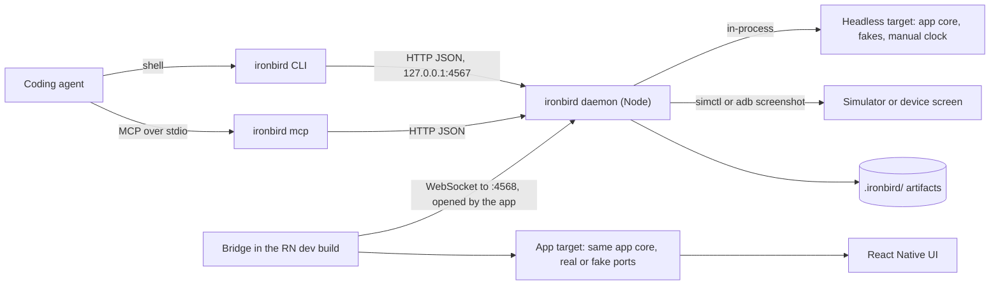
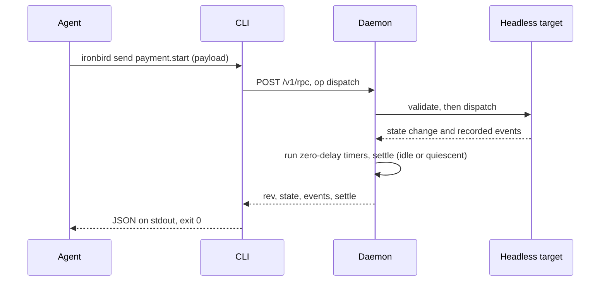
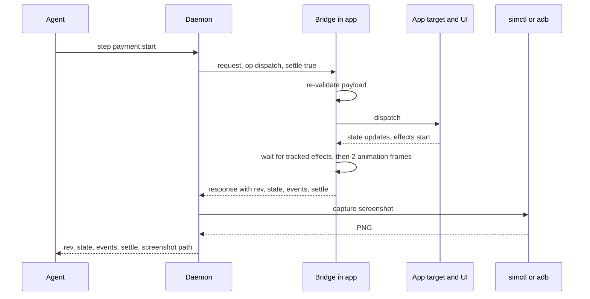

# ironbird: Architecture

| | |
|---|---|
| Status | Draft |
| Last updated | 2026-09-11 |
| Related | [spec.md](spec.md) · [protocol.md](protocol.md) · [api.md](api.md) · [ADRs](adr/) |

## 1. Context

ironbird gives coding agents a fast, deterministic way to drive React Native app logic and, when needed, to see the result on a real screen. It has two modes that share one protocol. In headless mode, the app's logic runs inside the ironbird daemon in Node, with fake ports and a manual clock. In remote mode, the same logic runs in the app's dev build on a simulator, emulator, or device, and the daemon reaches it through a bridge that the app opens.

The shape follows what Shopify described for its native apps: business logic separated from the UI and exposed to agents through a CLI, with a remote mode for simulators. React Native makes the headless half cheaper than it is natively, because the TypeScript that runs in Hermes also runs in Node.

## 2. Design principles

1. **Commands, not taps.** Agents change state through declared, validated commands and fake controls, and never through arbitrary code ([ADR-0001](adr/0001-commands-only-agent-surface.md)).
2. **One protocol, any target.** An operation means the same thing against headless and remote targets, so scenarios and agent habits transfer ([ADR-0002](adr/0002-one-daemon-many-targets.md)).
3. **Deterministic by default in headless mode.** Manual clock, scripted fakes, mutating operations processed one at a time. Nothing moves unless the agent moves it.
4. **No bridge in production.** Pure JavaScript, a dev-only bridge that is verifiably absent from release bundles, and a core whose tracker and recorder are switched off outside dev builds ([ADR-0003](adr/0003-app-dials-out-over-websocket.md), [ADR-0005](adr/0005-pure-javascript-no-native-code.md)).
5. **Checks decide; agents gather evidence.** Pass or fail comes from state conditions and exit codes, never from a model's reading of a screenshot.
6. **Adopt one flow at a time.** A single feature store can be wired up while the rest of the app stays untouched.

## 3. System overview



The daemon is the only long-lived process. CLI invocations and the MCP server are thin clients of its HTTP API. Remote apps connect to the daemon, never the other way around. Screenshots are captured on the host with platform tools, so the app needs no native code.

## 4. Packages

| Package | Runtime | Depends on | Contains |
|---|---|---|---|
| `@ironbird/core` | Node, Hermes | `zod` (peer) | Command registry, `Target`, fakes, clocks, tracker, event recorder, headless definition, protocol types, error codes |
| `@ironbird/react-native` | Hermes, dev builds | core; `react-native` (peer) | `startBridge`, settle detection, reconnection |
| `@ironbird/cli` | Node 22+ | core; WebSocket server, YAML parser, TypeScript loader, MCP SDK (confirm in M0) | Daemon, CLI commands, scenario runner, device helpers, `verify-bundle`, MCP server |
| `ironbird` | Node 22+ | `@ironbird/cli` | Wrapper that exposes the `ironbird` binary for `npx ironbird` |
| `@ironbird/testing` (P1) | Vitest, Jest | core, cli internals, fast-check | Scenario runner for test suites, model-based testing helper |
| `@ironbird/xstate`, `@ironbird/redux` (P1) | Node, Hermes | core; the library (peer) | `Target` adapters |

Dependencies point one way. Every package may depend on core, and core depends on nothing but Zod. The CLI never imports `@ironbird/react-native`.

`@ironbird/core` is the one package that can end up in a release bundle, because app code imports its `Clock`, tracker, and recorder. That is acceptable: core does no I/O, opens no connections, and never contains the bridge marker, and apps create the tracker and recorder with `enabled: __DEV__` so both are inert in release builds. The bridge, in `@ironbird/react-native`, is the only part that must be absent, and `verify-bundle` checks for it.

## 5. Integrating an app

Recommended layout inside an app:

```text
src/
  core/                    your app logic: stores or state machines, no react-native imports
    ports.ts               interfaces for api, storage, reader, analytics, clock
    adapters/              real implementations of the ports; may import react-native
    instance.ts            the instance the UI uses, wired with real adapters, tracker, and recorder
  ironbird/
    commands.ts            defineCommands(...)
    target.ts              toTarget(app): adapts your core to a Target
    fakes/                 defineFake(...) per port
    headless.ts            default export defineHeadless(...), loaded by the daemon in Node
    device.ts              startIronbird(): calls startBridge, required from index.js in __DEV__
ironbird.config.ts
ironbird/scenarios/*.yaml
```

Everything under `src/core/` and `src/ironbird/` must be importable in Node, except the parts that touch the real world: `core/adapters/`, `core/instance.ts`, and `ironbird/device.ts`. Two mechanisms keep it that way: an ESLint `no-restricted-imports` rule in the app, and the daemon's load-time error, which names the import chain when a `react-native` import sneaks in. The UI keeps using the same core instance it always did; ironbird only adds a second way in.

Adoption can start with one feature. For example, a checkout store gets commands, a target, and fakes for the card reader and payment API, while navigation, settings, and everything else stay as they are.

## 6. Core concepts

### 6.1 Commands

A command is a name plus a Zod schema. The registry validates payloads, produces JSON Schema for agents, and suggests close names for typos. Names are dot-namespaced by feature (`cart.addItem`, `payment.start`). Commands should describe user intent rather than implementation, `payment.start` rather than `setPaymentStatus`, so that a command means the same thing when replayed against the real app.

### 6.2 Targets

A `Target` adapts any state container. It needs `dispatch` for validated commands and `getState`, and optionally `subscribe`, `persist`, and `restore`. Each state notification or dispatch increments a revision, and every result carries the revision so clients can tell whether anything changed.

### 6.3 Ports, fakes, and controls

Apps reach the outside world through ports: interfaces for the API, storage, a card reader, analytics, and time. Real adapters implement ports in the app. Fakes implement them for headless mode and, optionally, for dev builds. A fake declares controls, each with its own Zod schema, that let an agent script the outside world: emit a reader disconnect, fail the next payment, delay responses, or deliver server events in a chosen order. Fakes record calls made to their port, so agents can confirm what the app asked for.

Fakes encode assumptions about real systems, and wrong assumptions are the main way ironbird can mislead. See [testing-strategy.md](testing-strategy.md#guidance-for-apps-using-ironbird) for how apps should keep fakes honest.

### 6.4 Clock

Code under test takes time from an injected `Clock`. Headless mode uses a `ManualClock`: timers fire only when the agent advances time, in due order, with promise jobs allowed to run between them. Zero-delay timers run as part of every step, so ordinary async code doesn't need explicit advances. Remote mode uses the real clock in v0.

### 6.5 Effect tracking and settle

The tracker records promise-returning port calls made through `tracker.wrap`, plus timers on a real clock that are due within a threshold (default 1 s). Wrapping is always explicit, so the app chooses the label; when the port being wrapped is a `FakeInstance.port`, which the fake tags with a private symbol, its calls are marked `fake: true`. Every step ends by settling, with three possible outcomes:

| Outcome | Meaning | Typical next move |
|---|---|---|
| Idle | No tracked effects or short timers pending | Read state or assert |
| Quiescent (headless only) | Only fake-backed work is pending, and nothing changed across several consecutive yields, so nothing will progress without `clock advance` or a fake control | Advance the clock or drive a fake |
| Not settled | Timeout reached while real-port effects are still pending | Inspect `pending`, retry, or `wait` for a state condition |

Quiescence counts only fake-backed effects, because a real network call that hasn't changed anything for a few milliseconds is still in progress. Results list pending labels and, in headless mode, how far away the next manual-clock timer is.

Remote settle adds the UI. The bridge dispatches, yields a macrotask so subscriptions and React scheduling can begin, waits until the tracker is idle, waits N animation frames (default 2), and re-checks the tracker before reporting idle. Time comes from the `Clock` given to `startBridge`, which defaults to the real clock and is shared with the tracker, so the no-device bridge tests can drive settle with a manual clock. `requestAnimationFrame` is a rendering signal, not a clock, and is used directly:

```ts
async function settle({ clock, frames = 2, timeoutMs = 5000 }) {
  const started = clock.now();
  await nextMacrotask(clock);
  while (clock.now() - started < timeoutMs) {
    if (tracker.pending().length === 0) {
      await animationFrames(frames);
      if (tracker.pending().length === 0) {
        return { idle: true, quiescent: false, waitedMs: clock.now() - started, pending: [] };
      }
    } else {
      await Promise.race([nextTrackerChange(tracker), delay(clock, 16)]);
    }
  }
  return { idle: false, quiescent: false, waitedMs: clock.now() - started, pending: tracker.pending() };
}
```

Known blind spots are promises created outside wrapped ports, animations running on the UI thread, layout animations, image decoding, and server pushes that haven't arrived yet. The mitigations are to route I/O through wrapped ports, reduce or disable motion in agent-driven dev builds, and use `wait` on a state condition for anything driven from outside the app. Whether JS-only signals are enough is open question Q5, tested in M1.

### 6.6 Event recorder

The recorder is a bounded, append-only log with monotonic sequence numbers and clock timestamps. Sources include fakes (controls fired, calls made) and anything the app wires in, typically analytics. Each step result includes the events recorded during that step, which is often better evidence than a screenshot for timing questions.

### 6.7 State, paths, and serialization

State that crosses the protocol must be JSON-serializable. Dates serialize through `toJSON`, and `undefined` properties are omitted as in JSON. Functions, `BigInt`, `NaN`, `Infinity`, `Map`, `Set`, class instances other than `Date`, and cyclic references are replaced with `{ "$unserializable": "<kind>" }` and reported once per path. Boxed primitives unwrap; an invalid `Date`, a throwing getter, or an uninspectable object gets a placeholder rather than an exception. Paths are dot-separated, with numeric segments for array indices. Results can be narrowed to a subtree with a path to keep agent context small.

## 7. Flows

### 7.1 Headless send



### 7.2 Remote step



### 7.3 Connection lifecycle

A daemon session serves one app. Its targets are the headless instance, when a headless entry is configured, plus one remote target per connected dev build of that app, so the same app on two simulators gives two targets. The session's app id comes from the headless target's description, or from the first bridge to connect when there is no headless entry; a later `hello` with a different app id is rejected with `APP_MISMATCH`. Serving several apps from one session is P2.

The app sends `hello` with the protocol version, app id, platform, and capabilities. The daemon replies with `welcome` and a target id, or `reject` with a reason, then requests `describe` and caches the app's commands and fakes. Target ids are assigned per platform in connection order: `ios`, then `ios-2`, and likewise `android`. When a connection drops, its id stays reserved and disappears from `status`, and the next `hello` for that platform takes the lowest reserved id, so a Metro reload keeps `--target ios` working. When two builds on the same platform reload at once they can swap ids; there is no device identity without native code, so the mapping from id to device stays manual until Q4 is resolved.

On disconnect, in-flight requests fail with `TARGET_DISCONNECTED` and are not retried, because the command may already have been applied. The bridge reconnects with exponential backoff from 500 ms to 5 s.

Each target processes mutating operations (`dispatch`, `fakeControl`, `clockAdvance`, `reset`, `snapshotLoad`) one at a time, in arrival order, because concurrency among them would make results depend on timing. Read-only operations (`describe`, `getState`, `events`, `settle`, `waitFor`, `fakeCalls`, `snapshotSave`, `clockNow`) run alongside them, so a pending `wait` never blocks the `clock advance` or command that would satisfy it. `reset` skips the queue itself, so it can recover a target stuck behind a dispatch that never settles; any operation still waiting in the queue, or in flight, fails with `TARGET_DISCONNECTED`. Operations that arrive while a reset is in progress run after it, against the new session.

## 8. Target selection

When `--target` is omitted, operations use `defaultTarget` from config, which is `headless` whenever a headless entry is configured. `step` and `screenshot` default to the only connected remote target. Anything ambiguous fails with `AMBIGUOUS_TARGET` and lists the options.

## 9. Security model

| Threat | Mitigation |
|---|---|
| Bridge shipped in a release or OTA bundle | `__DEV__` guard; bridge marker kept alive in the `hello` message; `ironbird verify-bundle` in CI for release builds and production exports |
| Another host or process driving a dev build | Daemon binds 127.0.0.1 by default; any non-loopback bind requires a token on both the HTTP API and the bridge handshake |
| `@ironbird/core` in a release bundle | Expected, because app code imports its `Clock`; core has no I/O, no network code, and no bridge marker, and its tracker and recorder are created with `enabled: __DEV__` |
| Code injection through the agent surface | No evaluation operations exist; only declared commands and controls, validated inside the app ([ADR-0001](adr/0001-commands-only-agent-surface.md)) |
| Malformed or hostile daemon messages | The bridge validates message shapes and payloads and rejects unknown operations |
| Sensitive data in artifacts | State, events, and screenshots may contain personal data; `.ironbird/` is gitignored by the setup template, and `doctor` warns if it isn't |

## 10. Performance budgets

| Path | Budget (p95) | Note |
|---|---|---|
| ironbird overhead per headless dispatch | < 5 ms | Excludes app logic |
| CLI invocation, headless, end to end | < 300 ms | Node startup dominates; the MCP server avoids it |
| Remote dispatch round trip, excluding settle | < 50 ms | Simulator on the same machine |
| Remote step with screenshot | < 1.5 s | Includes settle and capture |

## 11. Failure modes

| Failure | Behavior |
|---|---|
| Daemon not running | CLI exits 5 with a hint to run `ironbird serve` |
| Headless entry imports `react-native` | `HEADLESS_LOAD_FAILED` with the import chain |
| App disconnects mid-request | `TARGET_DISCONNECTED`; no automatic retry |
| Protocol version mismatch | Handshake rejected with `PROTOCOL_MISMATCH`; both versions reported |
| Settle timeout | Result has `idle: false` and pending items; CLI exits 3 |
| Screenshot tool missing or failing | `SCREENSHOT_FAILED` with the tool's stderr |
| Non-serializable state | Placeholder value and one warning per path |
| Manual clock runaway, such as a zero-interval loop | `clockAdvance` stops after 10,000 timer firings with `CLOCK_RUNAWAY` and the offending labels |

## 12. Decisions

| Decision | Recorded in |
|---|---|
| Commands-only agent surface | [ADR-0001](adr/0001-commands-only-agent-surface.md) |
| One daemon, many targets, one protocol | [ADR-0002](adr/0002-one-daemon-many-targets.md) |
| App dials out to the daemon over WebSocket | [ADR-0003](adr/0003-app-dials-out-over-websocket.md) |
| Zod 4 for command and control schemas | [ADR-0004](adr/0004-zod-4-schemas.md) |
| Pure JavaScript, no native code in v0 | [ADR-0005](adr/0005-pure-javascript-no-native-code.md) |
| MCP exposes a generic `ironbird_send` tool rather than one tool per app command | Here: keeps the tool list stable as apps connect and disconnect, and scales to large command sets. Per-command tools are P2 |
| Scenario files are YAML | Here: easy for agents and humans to write and review, and familiar to Maestro users |
| Clock control is headless-only in v0 | Here: controlling time on device interacts badly with animations and real I/O |
| One app per daemon session in v0 | Here: config, scenarios, and the headless entry are per app; several apps per session is P2 |
| Read-only operations bypass the per-target queue | Here: a `wait` must not block the operation that satisfies it, and reads don't affect ordering |
| `@ironbird/core` may ship in release bundles; the bridge never does | Here: app code needs core's `Clock`; the tracker and recorder are inert outside dev builds, and the marker lives only in `@ironbird/react-native` |

## 13. What we'd revisit as it grows

- Per-command MCP tools for apps with small command sets
- Clock control on device, if agent evals show a need
- An optional native add-on, if JS-only settle misses its stale-screenshot target (Q5)
- Automatic mapping from connections to devices (Q4)
- Web React and native targets over the same protocol
- Protocol v2, if one connection needs to carry several apps or multiplexed streams
